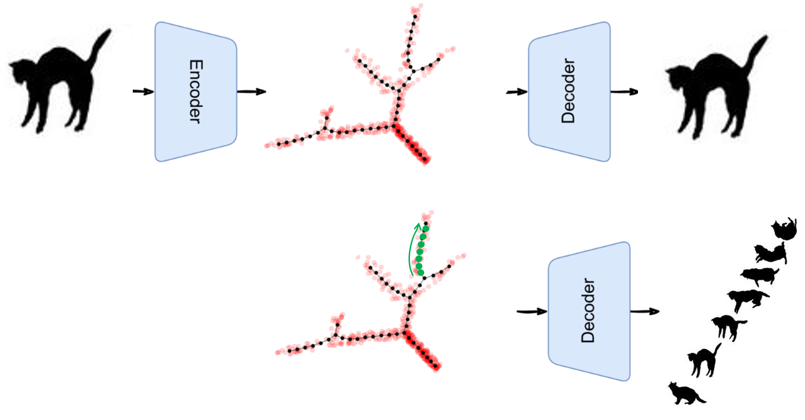

## Deep Fuzzy ElPiGraph method

New deep learning data representation approach has been suggested for shaping the geometrical structure of data latent space. The method uses a combination of variational graph autoencoders with the base algorithm of elastic principal graphs, [ElPiGraph](https://github.com/j-bac/elpigraph-python). The general idea is to organize the latent spaces of complex autoencoders as a set of branching trajectories such that the latent spaces could be more efficiently explored for the generative data modeling. 

Figure illustrating the method

The representation of data in the latent space is formed by embedding a set of centroids that form a fully connected weighted graph. The minimized loss function represents a sum of differentiable measure of proximity from a set of data point representations to the set of embedded centroids (computed via application of sofmax to the matrix of distances between data points and centroids) and the fuzzy version of elastc penalty of the graph embedding, defined previously for the elastic principal graph method. The elastic penalty is a weighted sum of squared edge lengths and the term representing a deviation of the graph embedding from harmonic embedding. The harmonicity term is adapted to the weighted representation of the graph.

The method is implemented as a standard torch.nn.Module Pytorch module that can be combined with various types of encoders and decoders, including simple autoencoders, VQ-VAE, but also with convolutional and graph encoders that make the application of the method suitable for the analysis of non-tabular data (images, graphs, chemical structures, texts) with the aim of trajectory discovery in the latent spaces of such datasets. 

Currently the module is tested with simple autoencoders and synthetic generation of datasets possessing the geometrical structure with branching trajectories. 
